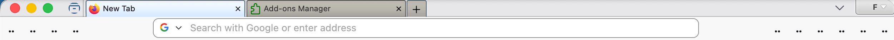
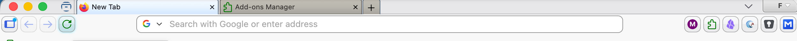

## Languages

- [English](README.md)
- [简体中文](README.zh-CN.md)
- [日本語](README.ja.md)

## Preview

Default state:  


Mouse over toolbar:  


## Downloads for Firefox

- **[CustomCSSforFx - current release & changelog](https://github.com/Aris-t2/CustomCSSforFx/releases)** - **[Last version with 102 ESR support](https://github.com/Aris-t2/CustomCSSforFx/releases/tag/4.2.8)**  
- **[Custom JavaScript scripts for Firefox](https://github.com/Aris-t2/CustomJSforFx)** - **[NoiaButtons CSS tweaks](https://github.com/Aris-t2/NoiaButtons)**  


## License

This project is dual-licensed under the GPLv3 and MPL 2.0, see the terms of the LICENSE files.  


## Instructions / Howto / Readme

- [Unlock custom CSS usage](#unlock-custom-css-usage)
- [WebExtensions can not modify Firefox appearance properly](#webextensions-can-not-modify-firefox-appearance-properly)
- [Where to find Firefox profile folder? The correct location for user styles.](#where-to-find-firefox-profile-folder-the-correct-location-for-user-styles)  
- [How to use custom user styles?](#how-to-use-custom-user-styles)  
- [How to find item ids and attributes?](#how-to-find-item-ids-and-attributes)  
- [How to modify custom user styles?](#how-to-modify-custom-user-styles)  
- [Firefox Color (compatible with default color preset of CustomCSSforFx)](https://color.firefox.com/)    

## Unlock custom CSS usage

`about:config` > `toolkit.legacyUserProfileCustomizations.stylesheets` > `true`  

## WebExtensions can not modify Firefox appearance properly

The only way to modify ui is adding custom CSS code to **userChrome.css** and **userContent.css** files inside browsers profile folder.  
Keep in mind CSS code can not create entirely new items, buttons or toolbars. It only can modify already present ui items.  

## Where to find Firefox profile folder? The correct location for user styles.

**1.** Find your profile folder ('profile names are different for everyone').  
`about:support > Profile Folder > Open Folder`  
or `about:profiles > Root Directory > Open Folder`  

**2.** User styles belong into `\chrome\` folder. Create it, if there is none yet. It should look like this afterwards:  
`\ PROFILE FOLDER NAME \chrome\`  

**3.** Copy `userChrome.css`, `userContent.css` and `\config\`, `\css\`, `\image\` folders into `\chrome\` folder. It should look like this afterwards:  
`\chrome\config\`  
`\chrome\css\`  
`\chrome\image\`  
`\chrome\userChrome.css`  
`\chrome\userContent.css`  

(Optional) Profile folders location on drive:  
**Windows**  
`C:\Users\ USERNAME \AppData\Roaming\Mozilla\Firefox\Profiles\ PROFILE FOLDER NAME \`  
Hidden files must be visible to see `AppData` folder. Alternatively open `%APPDATA%\Mozilla\Firefox\Profiles\` from explorers location bar.  
**Linux**  
`/home/ username /.mozilla/firefox/ profile folder name /`  
Hidden files must be visible to see `.mozilla` folder.  
**Mac OS X**  
`~\Library\Mozilla\Firefox\Profiles\ PROFILE FOLDER NAME \` or  
`~\Library\Application Support\Mozilla\Firefox\Profiles\ PROFILE FOLDER NAME \`  
`\Users\ USERNAME \Library\Application\Support\Firefox\Profiles\`  

## How to use custom user styles?

The _userChrome.css_ and _userContent.css_ files works like an options\configurations file. All main "features" can be enabled and disabled there.  
Edit _userChrome.css_ and _userContent.css_ with any text editor (**[Notepad++](https://notepad-plus-plus.org/download/)** recommended on Windows) and enable or disable any feature you like by modifying, removing or outcommenting available `@import` strings.  
Restart Firefox after every modification for changes to take effect.  

**Example**  
If "classic button appearance for navigation toolbar buttons" should be <u>enabled</u>, the corresponding line has to look like this:  
`@import "./css/buttons/buttons_on_navbar_classic_appearance.css"; /**/`  

If "classic button appearance for navigation toolbar buttons" should be <u>disabled</u>, the corresponding line has to look like this:  
`/* @import "./css/buttons/buttons_on_navbar_classic_appearance.css"; /**/`  

Note  
Code between `/*` and `*/` won't be used by Firefox unless there are other `/*` or `*/` inbetween.  

## How to find item ids and attributes?

Enable once:  
1\. Tools > WebDeveloper > Toggle Tools > 'Customize Tools and get help button' (= button with three dots) > Settings > Enable browser chrome and add-on debugging toolboxes  
2\. Tools > WebDeveloper > Toggle Tools > 'Customize Tools and get help button' (= button with three dots) > Settings > Enable remote debugging  

or set these two in about:config to true  

about:config > devtools.chrome.enabled > true  
about:config > devtools.debugger.remote-enabled > true  

Hit `Ctrl+Alt+Shift+I` or open 'Tools > WebDeveloper > Browser Toolbox'.  

Inspect ui or web content.  

Force popups to stay open for inspection: 
Click on 'Customize Tools and get help button' (= button with three dots) and select 'Disable popup auto-hide'.  

## How to modify custom user styles?

Open CSS files with a text editor. Look through the code and change values the way you need.  
Some files contain additional instructions about how to tweak the ui for individual cases.  
Restart Firefox for changes to take effect.  

_Example_  
Open `./css/tabs/classic_squared_tabs.css` file  
Look for `/* unloaded/pending tabs color *//*`  
Remove `/*` at lines end to make that part of the code active. Save the file and restart Firefox.  

_Example 2_  
Open `userChrome.css` file  
Look for `@import "./css/tabs/classic_squared_tabs.css"; /**/`  
Add `/*` at lines start to disable 'classic squared tabs' appearance.  
The result should look like `/* @import "./css/tabs/classic_squared_tabs.css"; /**/`  
  
_Example 3_  
Open `userChrome.css` file    
Look for `/* @import "./css/locationbar/reader_alternative_icon.css"; /**/`  
Remove `/*` at lines start to enable the alternative reader icon appearance.  
The result should look like `@import "./css/locationbar/reader_alternative_icon.css"; /**/` 

## Using a symbolic link for the `chrome` folder

Instead of copying the files from `current/` into a Firefox profile manually after every change, it is also possible to link the profile `chrome` folder directly to this repositories `current/` folder.

On macOS or Linux this can be done with a symbolic link.

Example:

```bash
ln -s "/path/to/CustomCSSforFx/current" "/path/to/Firefox/Profile/chrome"
```

In this setup Firefox will read the files directly from the repository checkout.
This is useful when modifying CSS often, because changes only need a Firefox restart and do not require copying files again.

Notes:

- remove or rename an existing profile `chrome` folder before creating the link
- make sure the linked `current/` folder contains `userChrome.css`, `userContent.css`, `config/`, `css/` and `image/`
- restart Firefox after every modification

On Windows a similar setup should also be possible by using a directory symbolic link or junction that points the profile `chrome` folder to the repository `current/` folder, but this has not been tested here.
